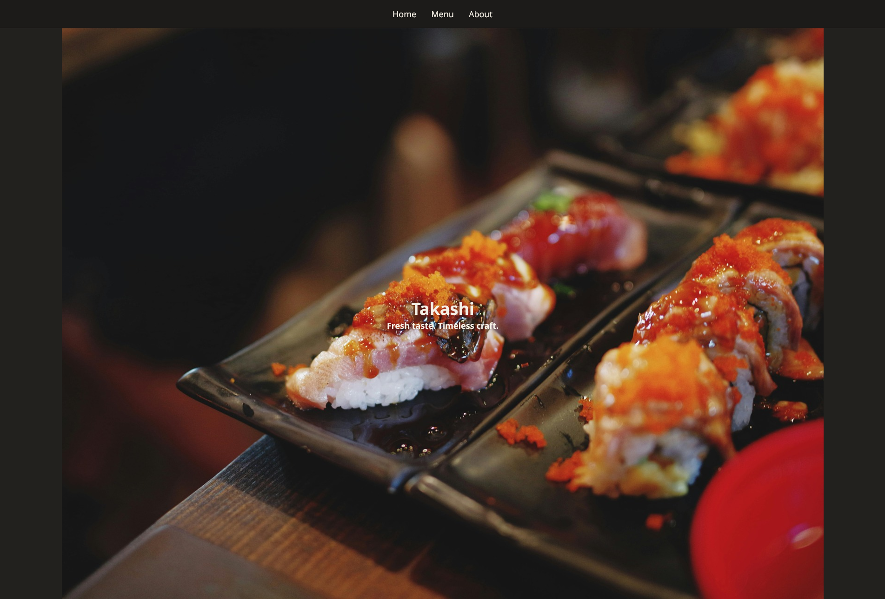

# Restaurant Page
This project is a simple website for a made up restaurant. The main concepts that were practiced while completing the project are bundling with Webpack, package setup/management with npm, and ES6 modules. Another small quirk about the site is that all the content is loaded dynamically through JavaScript rather than loading new pages when navigating pages for more DOM manipulation practice.

## Preview

## Credits
Photo Credits:
- [Chevanon Photography](https://www.pexels.com/@chevanon/)
